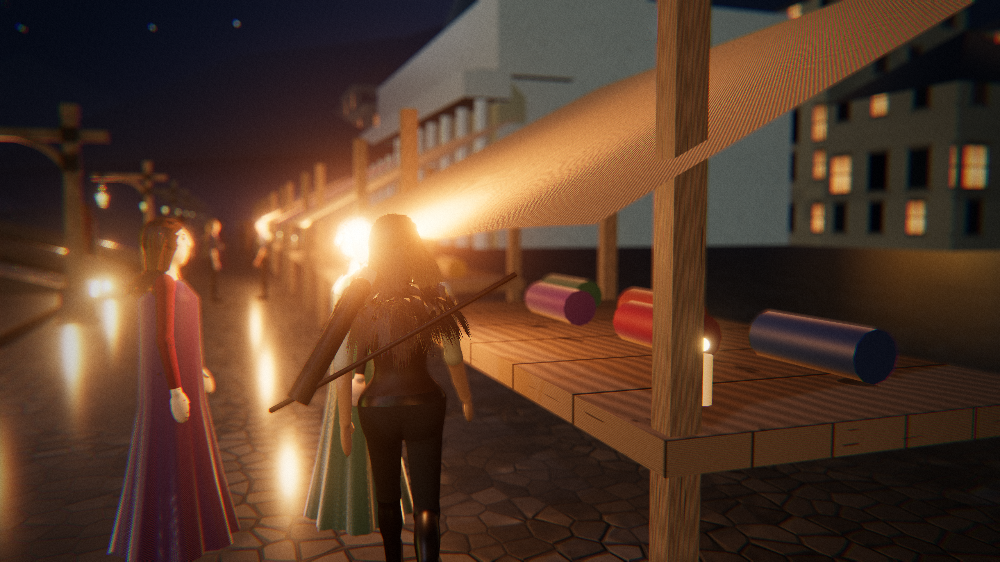
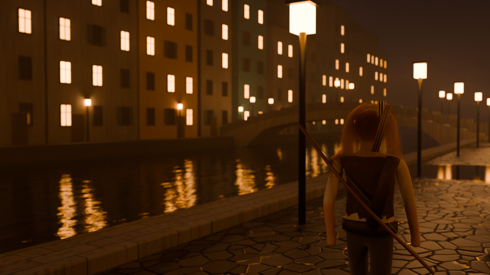
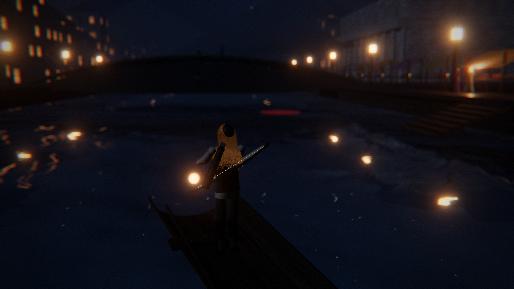
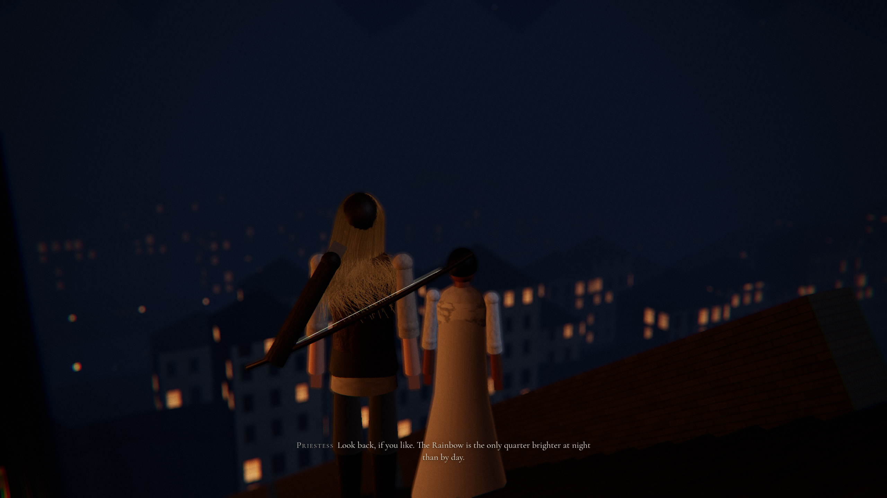
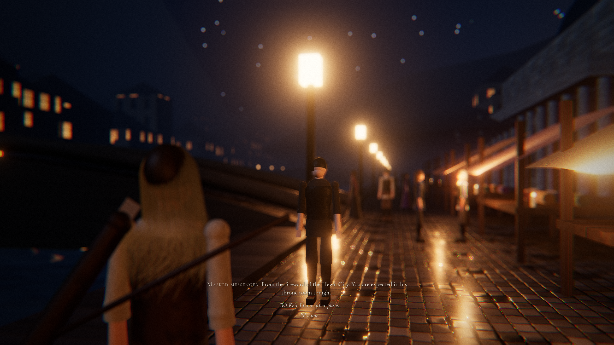
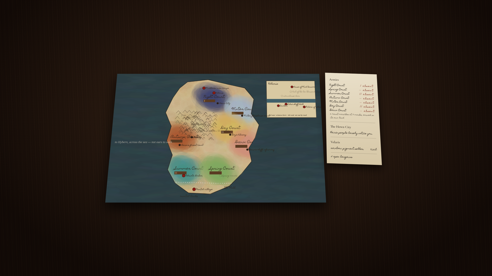

# Court of Mist

A third-person court-life game set in Prythian. This repository holds a **playable browser prototype** of one region, Velaris at night, together with the full game design in [`docs/DESIGN.md`](docs/DESIGN.md).

> Non-commercial fan project. Prythian and its people belong to Sarah J. Maas. All dialogue here is original.



## About fidelity

The target look is Unreal Engine 5 in-engine footage: Lumen, Nanite, scanned skin with subsurface scatter, groom hair, Chaos cloth. **This prototype doesn't reach that.** It runs on WebGL (three.js), and every asset is generated from code, with no scans, sculpts or authored textures. What it does try to get right:

- the lens: a 35 mm-equivalent field of view, shallow depth of field on the subject, ACES filmic tone mapping, fine grain, and motion blur only across cuts
- the light: moonlight, the Sidra's reflections, lit windows, lanterns, mist
- the materials: wet setts with puddled joints, weathered ashlar, painted plaster, woven linen and silk, creased leather, candle smoke
- the movement: a body with weight, plus simulated hair strands

Faces and bodies are procedural mannequins, so nobody should mistake them for MetaHumans. The design document lists what a UE5 production would put in their place.

## Run it

```bash
npm install
npm run dev        # open the printed localhost URL
npm test           # the game rules: bargains, trust, winnowing, wings
npm run build      # static build in dist/
```

A desktop GPU is recommended. Each frame draws the scene twice, once for the river's reflection and once for depth of field.

## Controls

| | |
|---|---|
| Mouse | look (click the view to capture the mouse) |
| W A S D | walk, or pole the skiff |
| Shift | run |
| E | speak or act |
| 1 2 3 | choose a reply |
| F | open your wings and fly, or land; Space and C to climb and descend |
| B | bargain slips |
| M | the painted map; click a red pin to winnow there |
| Esc | put the paper away |

## What's in the slice

- **Pigment in the Sidra.** The painter on the Rainbow steps lost three jars of pigment in the river. Take the skiff from the dock steps and hook them up. Asking what it's worth to her gets you a bargain slip.
- **A cousin at the Palace.** A masked Hewn City cousin is leaning on the silk sellers under the Palace arcade. Talk to the silk merchant first. You can't win this with a fight.
- **Ten thousand steps.** A priestess at the foot of the cliff stair wants company, on foot and at her pace.
- **The summons.** After your first job, a messenger from Keir finds you. You can refuse.

Winnow marks are learned by walking to them. Trust appears on the map's ledger, and a court's army only marches with work done on that court's land.

## Feyre's model

`docs/reference/` holds the character turnaround Feyre is built from. From those four views, Higgsfield (Meshy multi-image-to-3D) produces a textured, PBR, rigged GLB with a walk cycle. Save it as `public/models/feyre.glb`. The game then uses it in place of the procedural figure, plays the walk cycle at a speed matched to her movement, and attaches her wings to its shoulders. The Blender scene takes the same file with `--feyre public/models/feyre.glb`. Without the file, both fall back to the procedural figure.

## Path-traced frames (Blender Cycles)

`blender/velaris_quay.py` builds the same Velaris quay in Blender from code and path-traces it with Cycles. The scene includes:

- hand-laid wet setts with puddles
- the Sidra
- lit townhouses on both banks, and a stone bridge
- lanterns in volumetric river mist
- a silk-awning market
- Feyre with about 9,000 draped strand curves on the Principled Hair BSDF, skin with subsurface scattering, a linen shirt, a leather vest, a bow and boots

It renders through a 35 mm lens at f/2 with AgX tone mapping.

```bash
pip install bpy==5.0.1          # Blender as a Python module (Python 3.11), or use a Blender install:
python blender/velaris_quay.py --out docs/blender/velaris_quay.png --samples 160 --w 1920 --h 1080 --blend velaris_quay.blend
blender -b -P blender/velaris_quay.py -- --out docs/blender/velaris_quay.png
```



## Staged frames

```bash
node tools/capture.mjs                     # 2560×1440 into docs/shots/
node tools/capture.mjs boat --w 1280 --h 720
```

Shots: `market`, `boat`, `stairs`, `summons`, `table`, `slips`. Each is a real gameplay frame, rendered after the simulation has settled.

| | |
|---|---|
|  |  |
|  |  |

## Layout

```
src/core/      game rules and content (pure, tested)
src/world/     Velaris, sky, procedural materials, the human rig and hair
src/game/      player controller, townsfolk, side-job scripts
src/render/    lens and film post-processing
src/ui/        subtitles, bargain slips, the painted war table
tools/         headless capture of staged frames
docs/          design document and shots
```
