# Court of Mist

A third-person court-life game set in Prythian, playable in the browser. The game has:

- twelve regions
- Feyre's three acts and Nesta's campaign
- Solstice
- non-combat side jobs
- bargains kept as debts
- winnowing and wings
- a war table of seven courts

The full design is in [`docs/DESIGN.md`](docs/DESIGN.md).

> Non-commercial fan project. Prythian and its people belong to Sarah J. Maas. All dialogue here is original.

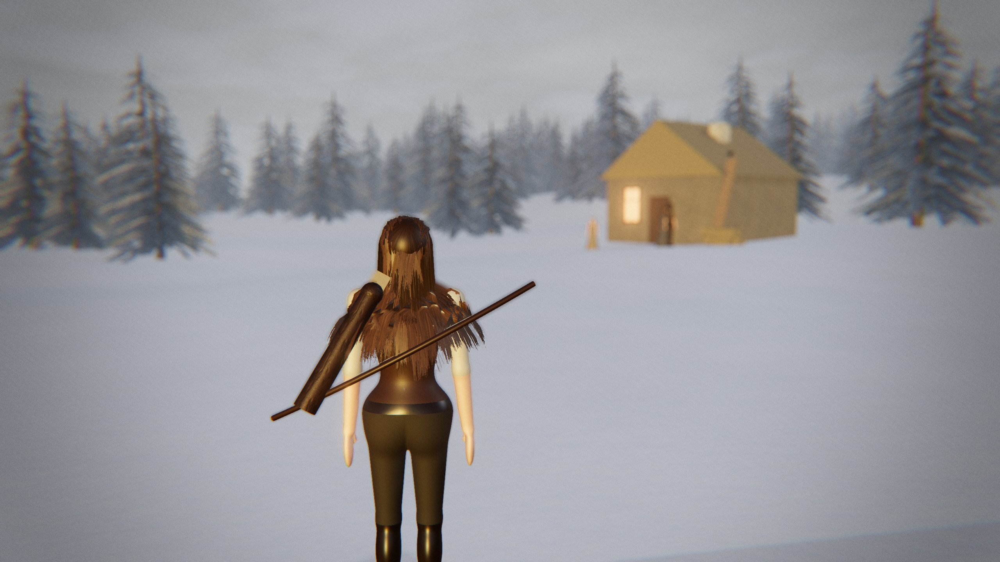

## About fidelity

The target look is Unreal Engine 5 in-engine footage. **This prototype doesn't reach that.** It runs on WebGL (three.js). What it does do:

- **Materials:** 2K tileable PBR sets (albedo, roughness, normal) baked from code.
- **Lighting:** real HDRI image-based lighting (CC0, Poly Haven), and a CC0 glTF lantern.
- **Lens:** a 35 mm-equivalent lens, depth of field, ACES tone mapping and film grain.
- **People:** each is one sculpted, skinned body with a modelled face, pointed fae ears, eyes with lids, and hair cards. Feyre also has simulated hair strands. The body comes from a signed-distance sculpt and is polygonised at load, and its clothing is drawn per pixel. They are still stylised, not scanned MetaHumans.
- **Foliage:** branch-card conifers with snow, leaf-card broadleaves, wind-blown grass tufts and rose bushes.

## Run it

```bash
npm install
npm run dev        # open the printed localhost URL
npm test           # the game rules: bargains, trust, winnowing, wings
npm run build      # static build in dist/
```

A desktop GPU is recommended. Each frame draws the scene twice, once for the river's reflection and once for depth of field.

## Controls

| | |
|---|---|
| Mouse | look (click the view to capture the mouse) |
| W A S D | walk, or pole the skiff |
| Shift | run |
| E | speak or act |
| 1 2 3 | choose a reply |
| Right / left mouse | draw the bow, loose or strike |
| Q | the power, once you have it |
| F | open your wings and fly, or land; Space and C to climb and descend |
| J | journal |
| B | bargain slips |
| M | the painted map; click a red pin to winnow there |
| Esc | put the paper away |

## What's in the game

- **Regions:**
  - the mortal village and cottage
  - the Spring manor
  - Under the Mountain (the trials)
  - Velaris and the House of Wind
  - the Hewn City
  - Windhaven
  - Adriata
  - the Autumn forest
  - the Winter glasshouse
  - the Dawn infirmary
  - the Day Court's library
  - the Middle (story only)
- **Story:**
  - Act 1: the hunt to the third trial.
  - Act 2: the bargain, Velaris, the Weaver and the Suriel.
  - Act 3: Keir, the queens, the spy and the High Lords' audiences, ending at the war table.
  - Nesta's campaign: the house, the ring, Emerie and the Blood Rite.
  - The journal (J) tracks where you are.
- **Side jobs:**
  - re-thatching the cottage roof
  - Emerie's clipped wings
  - Adriata's nets
  - reshelving in the Day library
  - the Hewn City confession hour
  - copying a ward
  - escorting the Rainbow singer between regions
  - Solstice gifts
  - the Velaris pigment, cousin and stair jobs
- **Systems:**
  - Winnowing to marks you have walked to.
  - Wings once you have them.
  - Bargains as debts written on slips.
  - Court trust that only moves for work done on that court's land.
  - Combat: melee, a bow with arrow drop, and one earned power.

## Higgsfield assets

The game streams assets generated with Higgsfield from its CDN (`src/content/hf_assets.js`), and falls back to its own files when the CDN can't be reached:

- **Characters.** Feyre (from the turnaround in `docs/reference/`), Rhysand and Nesta are rigged, PBR-textured Meshy models. Each carries five clips (idle, walk, run, a bow shot and a blade slash). The bow is held at full draw while you aim and released on the shot. Slashes and the power play on the upper body over the legs.
- **Surfaces.** 14 photographic materials (setts, ashlar, plaster, basalt, marble, timber, slate, thatch, grass, mud, snow, sand, bark, granite) were generated and made tileable, each with a derived normal map.
- **Voices.** All 65 character lines are voiced, including the High Lords' audiences, the favours and the Suriel. Each subtitle stays up until its line has been spoken.

`tools/hf/` holds the pipeline: `textures.py` (tileable PBR), `models.mjs` (WebP textures, meshopt, clip merging and retargeting), `verify.mjs` (renders shots where the CDN is reachable) and `voice_lines.mjs`.

## Feyre's model

`docs/reference/` holds the character turnaround Feyre is built from. From those four views, Higgsfield (Meshy multi-image-to-3D) produces a textured, PBR, rigged GLB with a walk cycle. Save it as `public/models/feyre.glb`. The game then uses it in place of the procedural figure, plays the walk cycle at a speed matched to her movement, and attaches her wings to its shoulders. The Blender scene takes the same file with `--feyre public/models/feyre.glb`. Without the file, both fall back to the procedural figure.

## Path-traced frames (Blender Cycles)

`blender/velaris_quay.py` builds the same Velaris quay in Blender from code and path-traces it with Cycles. The scene includes:

- hand-laid wet setts with puddles
- the Sidra
- lit townhouses on both banks, and a stone bridge
- lanterns in volumetric river mist
- a silk-awning market
- Feyre with about 9,000 draped strand curves on the Principled Hair BSDF, skin with subsurface scattering, a linen shirt, a leather vest, a bow and boots

It renders through a 35 mm lens at f/2 with AgX tone mapping.

```bash
pip install bpy==5.0.1          # Blender as a Python module (Python 3.11), or use a Blender install:
python blender/velaris_quay.py --out docs/blender/velaris_quay.png --samples 160 --w 1920 --h 1080 --blend velaris_quay.blend
blender -b -P blender/velaris_quay.py -- --out docs/blender/velaris_quay.png
```


## Staged frames

```bash
node tools/capture.mjs                     # every region and key scene, 2560×1440, into docs/shots/
node tools/capture.mjs region:hewn_city portrait --w 1280 --h 720
```

Each shot is a real gameplay frame, rendered after the simulation has settled.

| | |
|---|---|
| 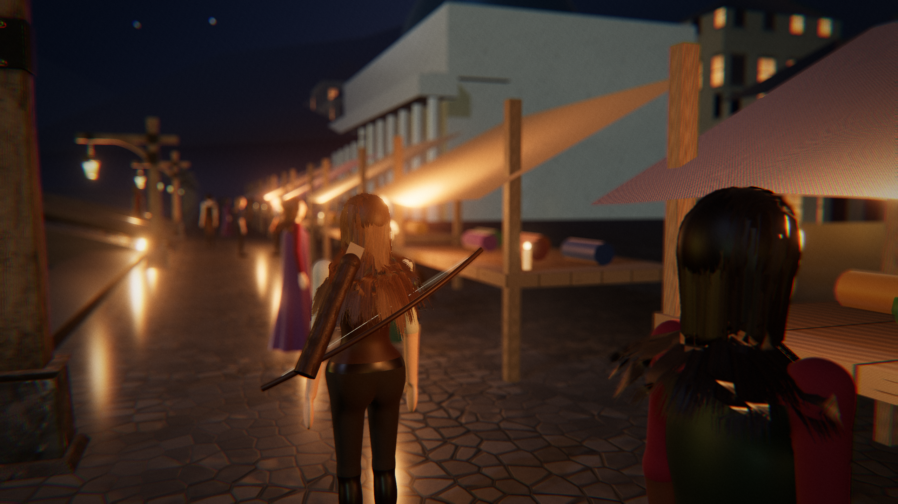 | 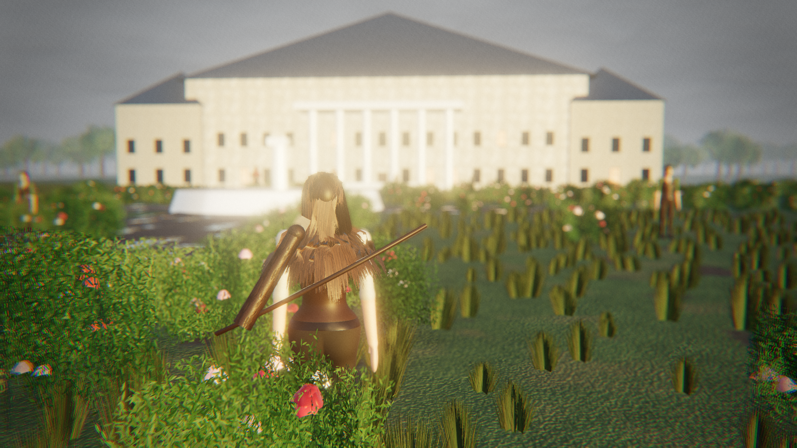 |
| 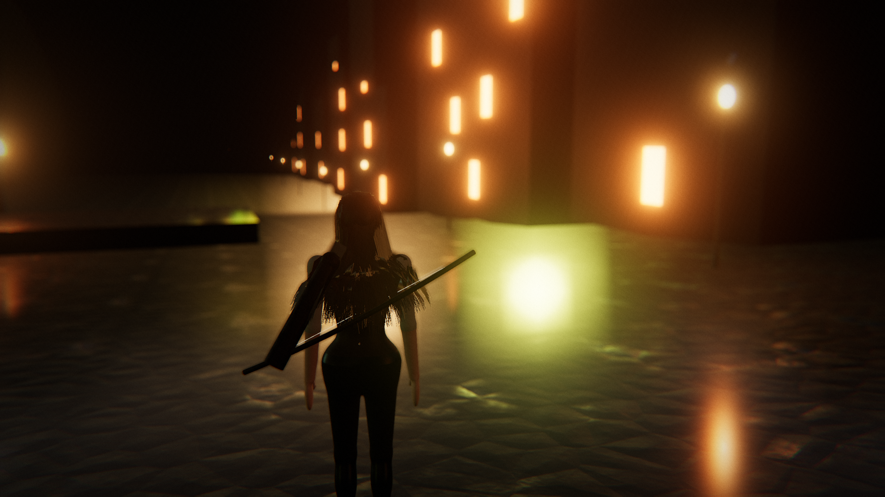 | 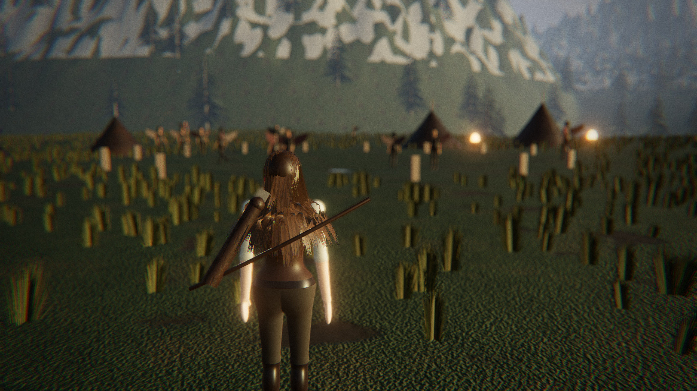 |
| 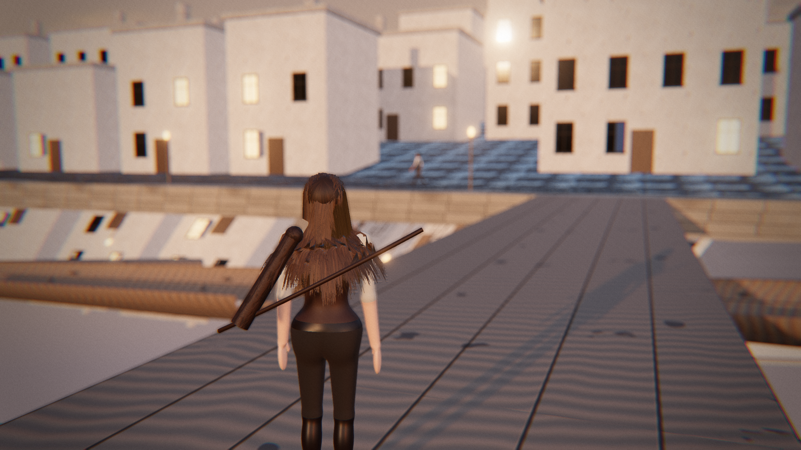 | 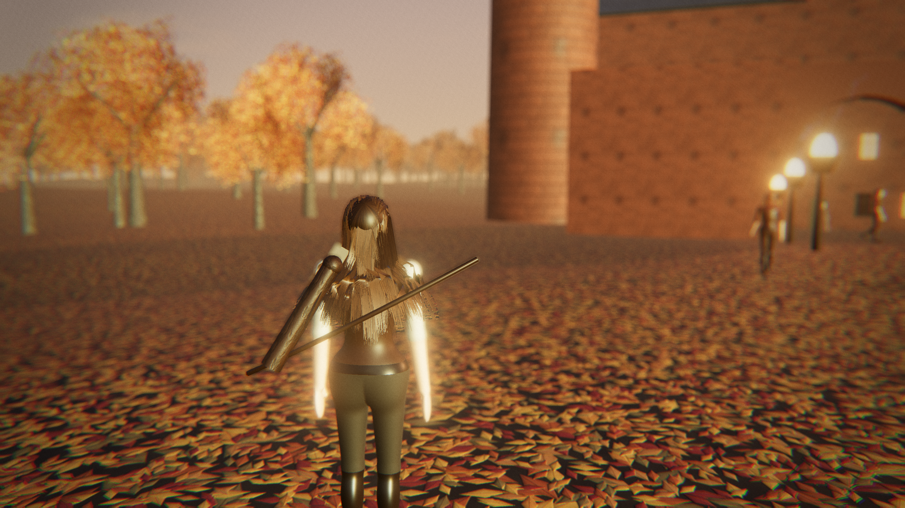 |
| 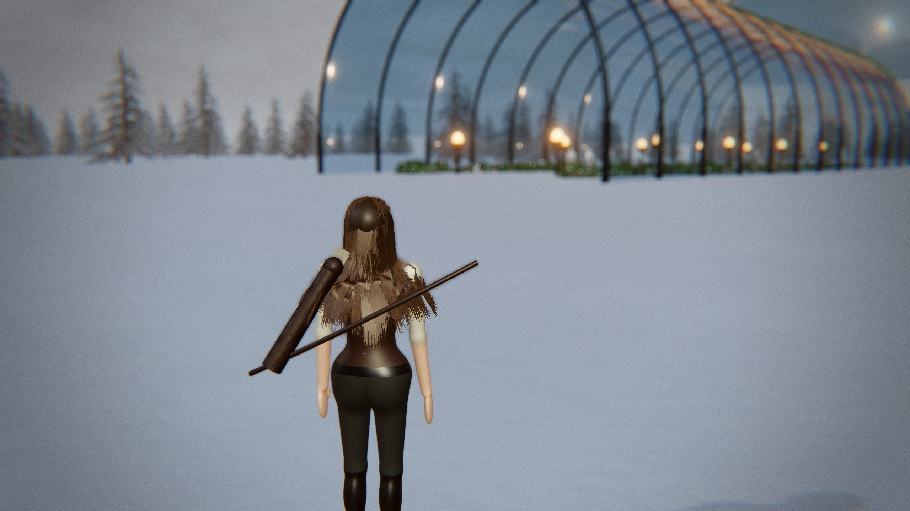 | 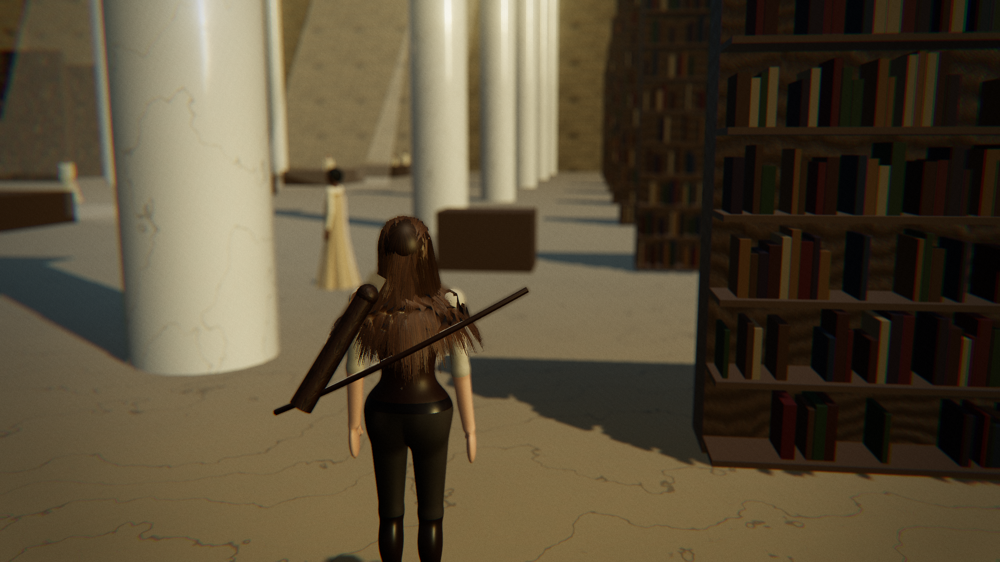 |
| 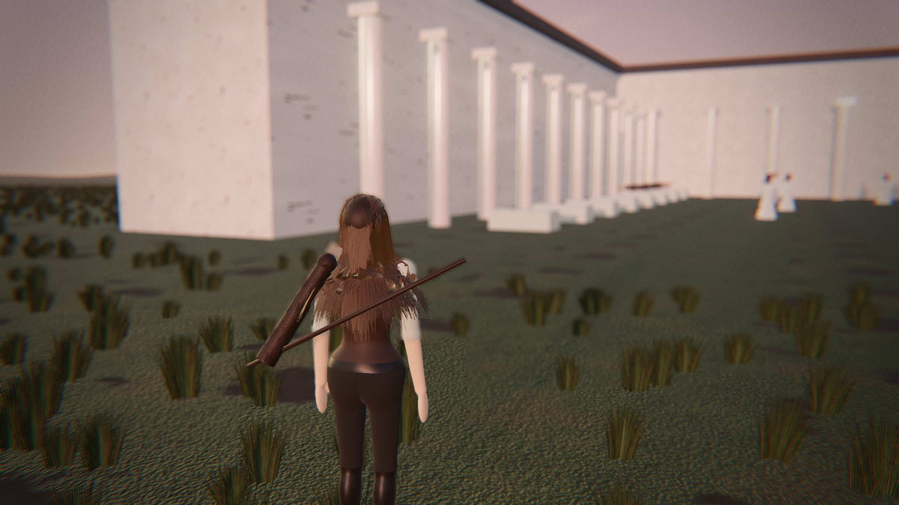 | 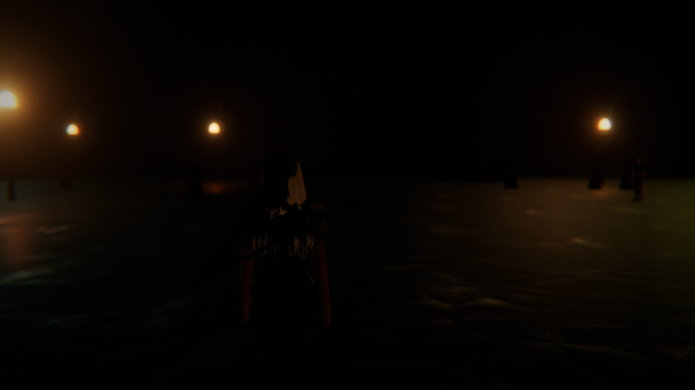 |
| 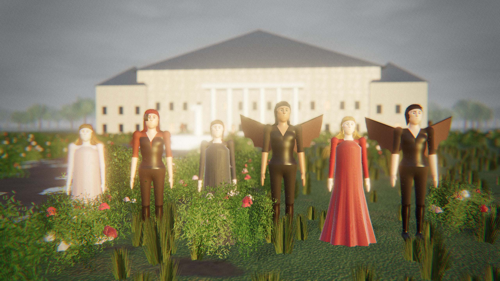 | 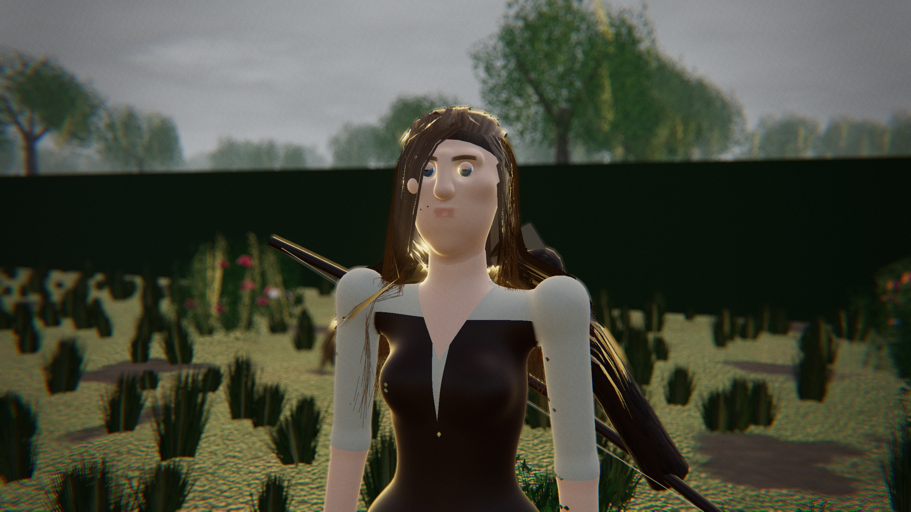 |
|  |  |

## Layout

```
src/core/      game rules and content (pure, tested)
src/regions/   the twelve regions
src/world/     building kit, sky, Velaris, the sculpted body, rig and hair
src/engine/    PBR texture, HDRI and model loading
src/game/      player, townsfolk, story director, side jobs, combat
src/render/    lens and film post-processing
src/ui/        subtitles, bargain slips, the painted war table
tools/         texture baking, playtest, smoke test, capture and recording
docs/          design document and shots
```
